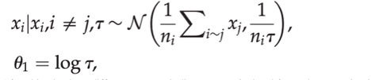

# Methology Investigation

Victor Tran

April 19

### Introduction
Informal economies are sections of national economies which are not under regulation of governments. They do not have to follow laws, pay taxes or follow any business restrictions. While there are some drawbacks to this such as not being able to apply for business loans, informal businesses benefit because they can basically choose their prices and costs (Rozo & Wrinkler) . They do not have to follow minimum wage laws, buy their resources from illegitimate companies for cheap and sell their products or services at low prices, making them very competitive against regular companies (Bougna & Nguimkeu). Informal economies are a symptom of the overall economic inequality that is found in many low-and-middle income countries such as Cameroon where the informal economy accounts for two thirds of the overall economy and 90% of workers in Cameroon are in the informal sector (Bougna & Nguimkeu). Lack of education, access to roads, and access to healthcare creates less competitive jobseekers. This forces them to work in illegitimate businesses for lower wages. In order for the informal economy to shrink, we need to identify which specific features are correlated with the informal economy and which regions are most affected by the informal economy. From this, policy could be made to address this issue. 

I am applying an explanatory inquiry since I want to know what covariates are most related to the informal economy, which areas are most anchored into the informal sector and what impact the informal economy has on the overall economy. The two Data Science methods mentioned below will assist me in this inquiry as they are helpful in classification and numerical distribution. 

### Sundsoy et al – Feed Forward Neural Network

Sundsoy et al’s goal was to be able to predict unemployment status using call detail records supplemented by census data. They believed that unemployment levels are an important indicator of labor market performance and the overall wellbeing of the economy since employment comes with higher purchasing power, less debt, and so on. First world countries such as the US are able to release unemployment statistics every two weeks, but it requires a significant amount of effort to process the data manually. The challenge to produce up-to-date unemployment statistics is much higher for LMIC’s where such data is less available. Sundsoy et al. wanted to identify a method to understand the unemployment levels based on easily accessible data, call detail records. They used a multi-layer feedforward network to predict unemployment status based on features in the call detail records. 

#### Datasets
Sundsoy et al. used a mix of traditional statistics data and modern Data Science datasets. Their main focus was to be able to use call detail records supplemented by household survey data to identify the unemployment levels of nations. First the authors acquired two different household survey datasets, which involved the employment status of the surveyed. This includes their current occupation (there were 18 different occupations to choose from, including non-financial one such as student), if they were unemployed or retired, and their most commonly used cell phone number. After this, they received call detail records from the leading cellular provider in the country. They did not specify the overall number of users within the dataset, but they said that they were able to match the call detail records of 76,000 of the 200,000 surveyed in the two household surveys. Through this, the researchers were able to connect cellular phone behavior of users with their employment status and/or occupation. The call detail records included 160 different features that provided thorough information about their cellphone and internet usage such as the towers that the phone connected to, number of text messages and phone call sent and received, number of interactions per contact, and the model of the phone. 

#### Method
The authors used a standard multi-layered feedforward neural network. They made 18 different networks, one for each kind of profession in the household surveys. They applied many techniques to optimize the neural network such as a standard stochastic gradient descent using backpropagation and using dropout to prevent overfitting. The training and testing data were split 75% and 25%, respectively.

#### Results
The results of the model varied based on profession, with an average accuracy of 67.5% with clerk having the highest accuracy of 73.5% and skilled worker having the worst accuracy of 61.9%. Compared to the baseline of 2.1%, the researchers obtained accuracy 30 times better than randomization. After that, the researchers then only included the top 20 features within their neural networks. From this, they realized that several features were commonly found in the top 20 of the 18 networks, examples of this are the most frequently used cellphone tower, number of places visited, and the radius of gyration (general distance traveled from home tower). After this, the researchers created a geographical distribution of profession and employment status across the country based on cellular tower data. 

### Steele at al. – Hierarchal Bayesian Geospatial Models

Steele et al’s goal was to be able to identify poverty on a subnational level using a variety of datasets including call detail records and remote sensing data. Similarly to Sundsoy et al, they found that low-and-middle-income countries did not have census data or it was out-of-date. Through the use of Bayesian geospatial models, they hope to be able to accurately produce subnational values of three popular poverty indices. They in particular wanted to identify what combination of datasets (CRD and RS) was most effective at predicting poverty. 
	
#### Datasets 

For this research, they studied Bangladesh. Steele et al used three different datasets which included information about financial data such as assets, income, and consumption of families. These three were the 2001 Bangladesh DHS, 2014 FII survey, and national household surveys by Telenor Group which covered 2013-2014. The researchers did not specify the number of participants in any of the three datasets. 

In terms of call detail records, they received their data from the most used cellular operator, GP. The company had around 50 million customers during the study and covered nearly 100% of population and 90% of the land area. Unlike Sundsoy, they did not go into detail about what features were included in the dataset. They simply said it contained information about phone usage, handset information, and social networks. 

The researchers did not use just one remote-sensing dataset, but rather 25. They were all varying in formatting and were a mix of raster and vector data, so they had to reformat them into one dataset using Voronoi polygons at 1km resolution.
 
From there, the researchers chose the most relevant covariates to include in their model using a series of techniques. They used generalized linear models to create all the different combination of covariates possible and models were chosen based on Akaike’s information criterion. 

#### Methods

Using the covariates chosen in the previous step, Steele et al created hierarchal Bayesian geospatial models. They used a variety of techniques to create these models such as integrated nested Laplace approximations and Gaussian Markov random field. From this, they formed the spatial random vector 
 
 
After this, the three different poverty indices were calculated for each Voronoi polygon. 
### Results

The researchers found that CDR-RS data was the most effective combination of data types for all situations compared to using only remote-sensing data or only call-detail record data, but not by a large margin. They found that usually the order of accuracy from most accurate to least was a combination of CDR and RS data, CDR data only, and RS data only. While the CDR-RS models were fairly consistent regardless of if the location was urban or rural, they found that CDR and RS only datasets were more effective on either urban zones or rural zones. RS only was more accurate in rural areas and CDR only was more effective at urban areas. 
 
### Relevance to my research question

Sundsoy and Steele’s work both contribute to my understanding of my research question. Sundsoy’s work focuses on classification of people and areas based on a variety of factors using cellular data. This is relevant to me because I am interested in identifying areas that are particularly focused in the informal economy. In Cameroon, these areas are generally urban with clerks and service workers being the most common member of the informal economy. Since Sundsoy focuses on profession, which is also related to the informal economy, I could use a similar technique to theirs that instead focus on classification of the informal economy

Steele et al. used a mix of cellular and remote sensing data to predict the levels of poverty in subnational regions of Bangladesh. This relates to the second part of my research question which focuses on being able to predict the effects of the information economy by using covariates that are related to the level of the informal economy in a certain region.  
